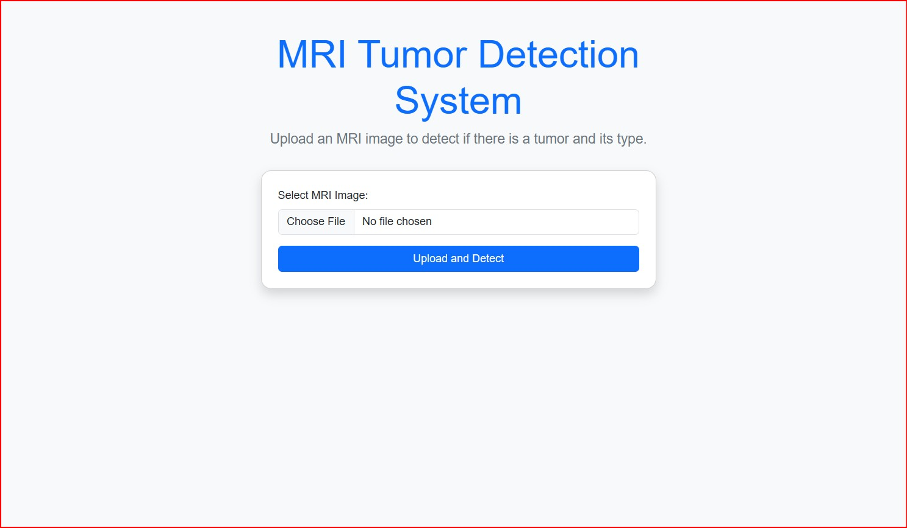
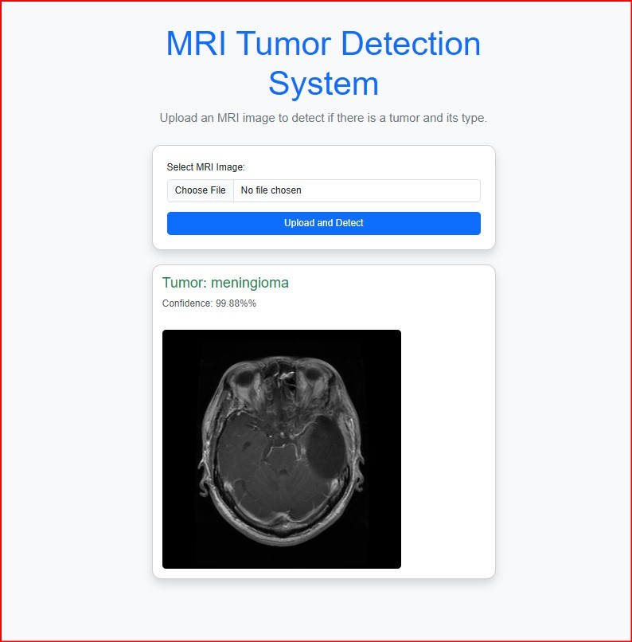

# 🧠 Brain Tumor Detection and Classification

A deep learning-based web application that detects and classifies brain tumors from MRI scans using a Convolutional Neural Network (CNN). The trained model is integrated into a Flask web app with a simple user interface.
---
## 📌 Key Features
- Upload MRI images for brain tumor detection
- CNN-based model trained on MRI datasets
- Flask-powered web interface
- Display of prediction results with confidence
- Responsive frontend for smooth usage
- Preview of input MRI and detected output
---
## 📁 Directory Structure
'''bash
.
├── models/ # Training notebooks and saved CNN model (model.h5)
├── templates/ # HTML frontend (index.html, result.html)
├── uploads/ # Uploaded MRI images
├── static/ # CSS, JS, images
├── main.py # Flask backend app
├── requirements.txt # Python dependencies
├── homepage.jpg # Homepage screenshot
├── output.jpg # Sample output screenshot
└── README.md # Project documentation
---
'''
## 🔧 Installation
### 1. Clone the Repository
```bash
git clone https://github.com/Poojaaaa27/brain-tumor-detection-and-classification.git
cd brain-tumor-detection-and-classification
2. Create Virtual Environment & Install Dependencies
bash
Copy
Edit
python -m venv venv
venv\Scripts\activate       # Windows
source venv/bin/activate    # Mac/Linux

pip install -r requirements.txt
3. Run the Application
bash
Copy
Edit
python main.py
4. Open in Browser
http://127.0.0.1:5000/
📊 Visual Outputs
 
🛠 Tech Stack
Python
Flask

TensorFlow / Keras

HTML, CSS
